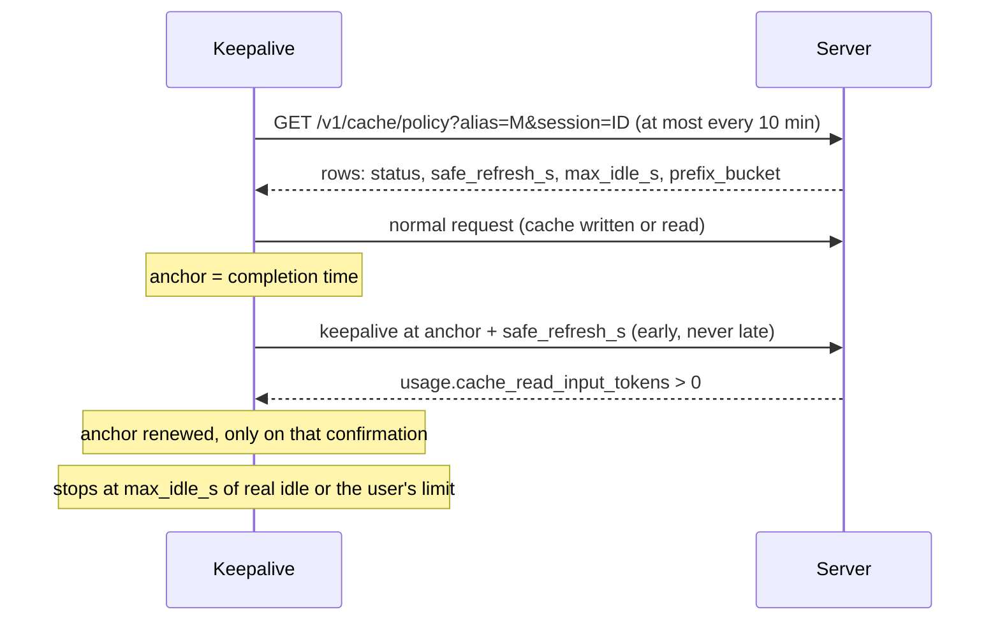

# Cache policy protocol

How an inference server or gateway tells Keepalive how long a model's prompt cache stays reusable, so `warm` can refresh it just in time. Any server can implement it: a gateway, LiteLLM, vLLM, a llama.cpp server behind a proxy, or a provider.

## 1. Purpose

Keepalive keeps a prompt cache warm by sending a tiny request that reuses the cached prefix. It must send that request before the cache expires, and only the server knows when that is.

- **Anthropic responses** that report `cache_creation.ephemeral_5m_input_tokens` / `ephemeral_1h_input_tokens` need no server support. Keepalive uses those lifetimes.
- **Any other model** is monitor-only unless the server publishes a policy as described here.



## 2. Endpoint

```
GET {base_url}/v1/cache/policy?alias=<model>&session=<id>
```

- `base_url`: the client's inference base URL (`ANTHROPIC_BASE_URL`), path prefix included. The client never asks `api.anthropic.com`; it requires https, or http on loopback.
- `alias`: the model name exactly as sent in inference requests. Required.
- `session`: the client's session id. Optional; may be omitted.
- **Auth:** the same as inference. The client sends `Authorization: Bearer <token>`, or `x-api-key: <key>` when there is no token.
- **Redirects:** must not redirect. Answer directly.
- **Size:** JSON, under 64 KB (larger bodies are discarded), at most 64 rows. A request that takes more than 5 s is abandoned.
- **Caching:** the client caches a good answer for 10 minutes per alias. After an error it backs off 30 s, 1 min, 2 min, 5 min, then 10 min between tries. `Cache-Control` is ignored and optional.
- **No policy:** `404`, or any non-200, means no policy: the client keeps its existing behaviour (monitor-only for non-native models). Never return 200 with a guess.

## 3. Response

```json
{
  "rows": [
    {
      "alias": "kimi-k3",
      "cohort": "openrouter|phala|moonshotai/kimi-k3",
      "resolution": "exact",
      "status": "enabled",
      "safe_refresh_s": 480,
      "max_idle_s": 3600,
      "refresh_on_read": true,
      "prefix_bucket": 12,
      "upstream_provider": "phala",
      "upstream_model": "moonshotai/kimi-k3"
    }
  ],
  "server_now": "2026-10-07T12:00:00Z"
}
```

| Field | Type | Used by client | Meaning |
|---|---|---|---|
| `rows` | array | yes | One row per cache the alias can land in, per prefix bucket. |
| `status` | string, required | yes | `enabled`, `shadow`, `insufficient_data`, `fixed_window`, `demoted` or `native`. Any other value drops the row. |
| `safe_refresh_s` | integer seconds, 1–604800, or `null` | yes | See §4. |
| `max_idle_s` | integer seconds, 1–604800, or `null` | yes | Stop warming after this much real idle time. `null` = no server limit. |
| `prefix_bucket` | integer, or omitted (= 0) | yes | `floor(log2(prefix tokens))` this row applies to. |
| `upstream_provider` | string ≤ 200 | shown | Who serves it; shown in the panel (`via <provider>`). |
| `upstream_model` | string ≤ 200 | stored | Backend model name. |
| `alias` | string ≤ 200 | validated | Echo of the request. If present it must be a valid string. |
| `cohort`, `resolution` (`exact` / `session` / `min`), `refresh_on_read`, `server_now`, any other field | any | ignored | Informational; clients must tolerate and servers may add more. |

A row with an invalid `status`, a non-integer or out-of-range `safe_refresh_s` / `max_idle_s`, or a non-integer `prefix_bucket` is ignored.

## 4. What the server must guarantee

- **`safe_refresh_s`**: the longest time after the end of the last cache-touching request at which a refresh still hits the cache with high probability. The server applies its own safety margin (include request latency). The client fires within 5 s before `anchor + safe_refresh_s`, never after, and does not catch up a missed window, so a value that is too large costs a miss while a smaller one only costs a few extra reads.
- **Only `enabled` warms.** `shadow`, `insufficient_data`, `demoted`, `fixed_window` and `native` are shown and never acted on. When unsure, return one of those. Never guess.
- **`refresh_on_read`**: a refresh only helps if a cache read extends the lifetime. If reads do not extend it (a fixed window from first write), report `fixed_window`, not `enabled`.
- **`max_idle_s`**: the point after which warming costs more than it saves, as measured by when users usually return. The client counts it from the last real request.
- **`prefix_bucket`**: the client picks the highest bucket not above `floor(log2(cached prefix tokens))`; with a tie it takes the more cautious row (not `enabled`, then the smaller `safe_refresh_s`). Publish one bucket (0) if lifetime does not depend on size.
- **Sessions**: if an alias can be served by several caches, return the row for the cache this `session` last hit (`resolution: "session"`). With no session information return the most conservative row (`min`: the smallest `safe_refresh_s`) rather than the best.
- **Demote quickly.** If refreshes start missing, switch to `demoted` (or lower `safe_refresh_s`) within minutes. The client refetches at most every 10 minutes, so keep the published value conservative.

## 5. Usage reporting

The client confirms every keepalive from the response's Anthropic Messages `usage`:

- `cache_read_input_tokens`, `cache_creation_input_tokens`, `input_tokens` (uncached only) and `output_tokens` must be reported accurately.
- A server translating from OpenAI-style usage must make `input_tokens` exclude cached tokens (`prompt_tokens − cached_tokens`) and put those in `cache_read_input_tokens`.
- The countdown is renewed only when `cache_read_input_tokens > 0`. A keepalive that only wrote the cache does not renew it, and the next one is still due at the old time.

## 6. Recognising a keepalive

The last user message begins with `<keepalive v="X.Y.Z"/> Reply with only: K` (`X.Y.Z` is the plugin version). Match it with:

```
<keepalive v="(?P<version>[0-9A-Za-z.+-]{1,32})"/>
```

A server may use it to classify, bill (it is mostly cache-read tokens), or count adoption. It must be routed to the same backend, replica or slot as the session's real requests, or it will not hit the cache: keep session affinity for keepalives exactly as for normal requests.

## 7. Implementing it

**Fixed lifetime (documented TTL, known KV eviction).** Publish a static policy: `safe_refresh_s = documented minimum lifetime − margin`, `status: "enabled"` if reads extend it, else `fixed_window`.

```python
TTL_S, MARGIN_S = 300, 45          # documented lifetime, latency + safety
REFRESH_EXTENDS = True             # does a cache read reset the clock?

def policy(alias, session):
    model = backends.get(alias)
    if model is None:
        return 404
    return {"rows": [{
        "alias": alias, "prefix_bucket": 0,
        "status": "enabled" if REFRESH_EXTENDS else "fixed_window",
        "safe_refresh_s": TTL_S - MARGIN_S,
        "max_idle_s": 3600,
        "refresh_on_read": REFRESH_EXTENDS,
        "upstream_model": model.name,
    }], "server_now": utcnow()}
```

**Best-effort caches (LRU under memory pressure).** Learn the lifetime from traffic:

1. Label consecutive requests of the same session and backend: the idle gap `g` since the last request that touched the cache, and whether the next request read at least 90% of the previous cached prefix (hit = alive at `g`). Drop pairs where the prompt shrank sharply (compaction) or the backend changed.
2. Per backend × model (and prefix size), estimate P(alive | gap) with a monotone classifier, or an empirical hit rate by gap bin with a Wilson lower bound. Add time of day if load matters.
3. Set `safe_refresh_s` to the largest gap whose lower bound reaches your target (e.g. 99%), minus a margin, within the gap range you actually observed.
4. Gate: publish `enabled` only after a forward holdout (data newer than the training set) meets the target with enough independent sessions; otherwise `shadow` or `insufficient_data`.
5. Demote on a burst of keepalive misses. Derive `max_idle_s` from when sessions typically resume.

Because clients never refresh later than published, you only learn longer lifetimes from sessions without keepalives, so keep gaps beyond `safe_refresh_s` observable.

## 8. Security

- Same origin as inference, same credentials; clients send them only to the configured base URL and never follow policy redirects deliberately. Do not redirect.
- Scope `session` to the authenticated caller: never return or reveal another user's session state, and ignore an unknown or foreign session rather than erroring.
- Return no secrets, prompts or per-user data. Rows describe caches, not people.
- Validate `alias` and `session`; they are client-supplied. Rate-limit the endpoint (a client asks about once per 10 minutes per alias).
